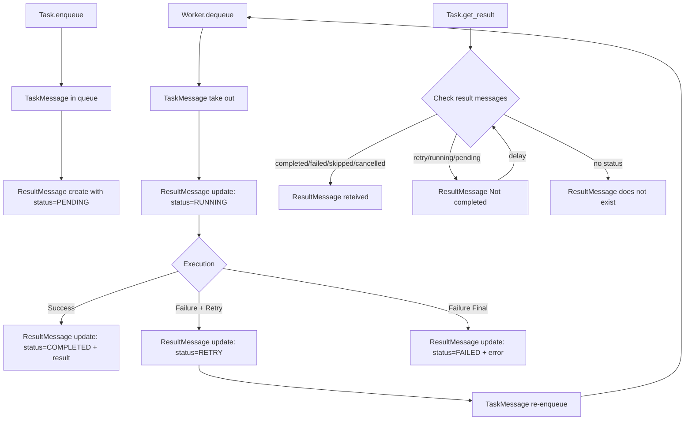

# Task framework

All it does is take a task and process it


## Description
See docs/ for details information on [workers](docs/worker.md), [queues](docs/queue.md), [orchestrator](docs/orchestrator.md), [tasks](docs/task.md), [monitoring](docs/monitoring.md)

Need 3 components:
- a queue, either redis or custom ( if it's a custom one it might need a custom queue implementation)
- worker(s), set the config and the task available to use, could be a worker or a orchestrator
- the app that need a task worker

## Install
### Pip
```sh
git clone https://github.com/{org}/task-framework.git
cd task-framework
pip install -e . 
```

### Pipenv, pipfile
```
[packages]
task-framework = {git = "https://github.com/{org}/task-framework.git", ref = "v1.2.0"}
```
## Structure

### Overall



## Usage

### Orchestrator
```python
# project1/tasks/my_task.py
from task_framework import Task, TaskParams

class MyTaskParams(TaskParams):
    source: str
    output_dir: str
    batch_size: int

class MyTask(Task):
    params_model = MyTaskParams
    
    def run(self):
        source = self.get_param('source')
        output_path = self.get_param('output_path')
        batch_size = self.get_param('batch_size')
        
        print(f"Extraction: {source} -> {output_path} (batch: {batch_size})")
        pass
```

```python
# project1/myworker.py
import logging
from task_framework import TaskRegistry

LOGGER: logging.Logger = logging.getLogger(__name__)

def run():
    worker_id = os.environ.get('WORKER_ID')
    redis_host = os.environ.get('REDIS_HOST')
    
    LOGGER.info(f"Starting worker with ID: {worker_id}")

    registry = TaskRegistry()
    registry.register("task1", Task1)
    registry.register("task2", Task2)
    registry.register("task3", Task3)

    worker = TaskWorker(queue, registry, max_retries=5)
    worker.run()

if __name__ == "__main__":
    run()
```
        

```sh
task-orchestrator -n 4 -q localhost:6379 myworker.py
```

### Simple worker

```sh
python -m task_framework.workers.worker_process \
  --worker-id worker_1 \
  --redis-url redis://localhost:6379 \
  --queue-name tasks \
  --log-level INFO
``` 

```sh
python -m task_framework.workers.worker_process \
  --worker-id prod_worker_1 \
  --redis-url redis://prod-redis:6379 \
  --queue-name production_jobs \
  --log-level WARNING \
  --max-retries 5
```